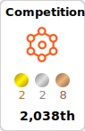
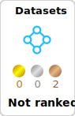
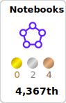
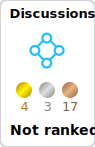
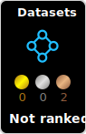
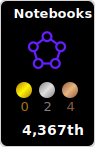
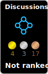

# Kaggle Badges

[English](./README.md) | [Japanese](./docs/README.ja-jp.md)

## Summary

This project automatically generates badges based on your Kaggle rank. It creates various styles of badges for each category: Competitions, Datasets, Notebooks, and Discussions. By utilizing it as a GitHub Actions Workflow, you can enhance your GitHub Profile (example: https://github.com/spider-man-tm).

Below is a list of badges for Competitions. Similar style badges are automatically generated for Datasets, Notebooks, and Discussions.

| Grandmaster                                                                | Master                                                           | Expert                                                           | Contributor                                                                |
| -------------------------------------------------------------------------- | ---------------------------------------------------------------- | ---------------------------------------------------------------- | -------------------------------------------------------------------------- |
| []()     | []()     | []()     | []()     |
| []()     | []()     | []()     | []()     |
| []() | []() | []() | []() |
| []() | []() | []() | []() |

Additionally, we automatically generate badges based on the number of medals earned.

|                                                  |                                              |                                               |                                                 |
| ------------------------------------------------ | -------------------------------------------- | --------------------------------------------- | ----------------------------------------------- |
|  |  |  |  |
|  |  |  |  |

## Usage

### 1. Create a repository

Create a repository with the same name as your GitHub username. This repository will be displayed on your GitHub profile. For example, my GitHub username is spiderman-tm, so the repository name will be spiderman-tm.

- ref. [Managing your profile README](https://docs.github.com/en/account-and-profile/setting-up-and-managing-your-github-profile/customizing-your-profile/managing-your-profile-readme)

### 2. Set workflow permissions

You need to enable GitHub Actions in the repository settings. Go to
Settings > Actions > General > Workflow Permissions > Read and write access


### 3. Create a workflow direcotry and file

Create a directory named .github/workflows in the root directory of the repository. Then, create a YAML file in the .github/workflows directory. The name of the YAML file can be anything. For example, kaggle-badges.yml.

### 4. Add the following code to the YAML file

Copy the following code and paste it into the YAML file. Replace { Your Kaggle Username } with your Kaggle username. If you prefer not to directly include your Kaggle username in the YAML file, you can use GitHub Secrets to store the value instead. Use whichever method you prefer.

- ref. [Using secrets in workflow](https://docs.github.com/en/actions/security-guides/using-secrets-in-github-actions)

```yaml
name: Kaggle Badges

on:
  schedule:
    # You can change the cron expression to suit your needs
    - cron: "11 11 1 * *" # 11:11 AM on the 1st of every month
  workflow_dispatch:

jobs:
  create-badges:
    runs-on: ubuntu-latest

    steps:
      - name: Checkout repository
        uses: actions/checkout@v4

      - name: Setup Node.js
        uses: actions/setup-node@v4
        with:
          node-version: "20"

      - name: Install Puppeteer browser
        run: npx puppeteer browsers install chrome@126.0.6478.63

      - name: Use Kaggle Badges Action
        uses: spider-man-tm/kaggle-badges@v1.1.1
        with:
          # ex. user_name: spidermandance
          user_name: { Your Kaggle Username }
          # example of using GitHub Secrets
          # user_name: ${{ secrets.KAGGLE_USERNAME }}

      - name: Commit and Push SVG files
        run: |
          git config --local user.email "action@github.com"
          git config --local user.name "GitHub Action"
          git add ./kaggle-badges/* ./kaggle-plates/*
          git commit -m "Add generated SVG files" || echo "No changes to commit"
          git push
```

### 5. Commit and push the YAML file

Commit and push the YAML file to the repository. The workflow will start automatically. The workflow will generate badges and push them to the repository.

### 6. Add badges to your README.md

Add the following code to your README.md file.

e.g.

```markdown
# Markdown


```

```html
<!-- HTML -->


```

Following is my GitHub Profile README.md as an example

- ref. [https://github.com/spider-man-tm](https://github.com/spider-man-tm)

## Local Development

At first, Node.js and yarn will be required, so please prepare.

You can run the following command to install the dependencies, and then run the script to generate the badges. These commands are defined in the package.json file.

```shell
# Install dependencies
yarn install

# build
yarn build

# test
yarn test

# generate badges
yarn local-run
```

## License

MIT License

(C) 2024 Takayoshi MAKABE
